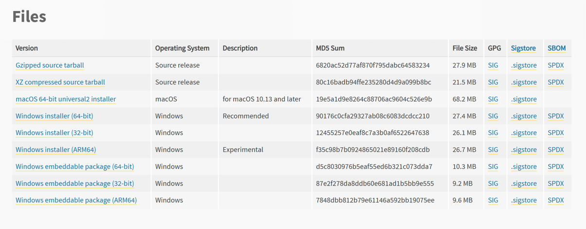
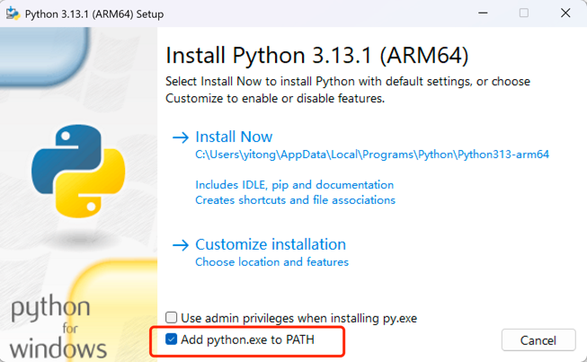
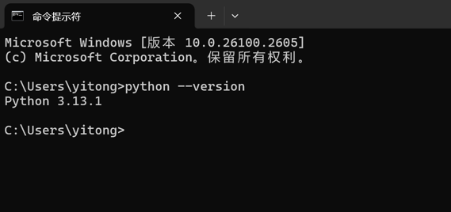
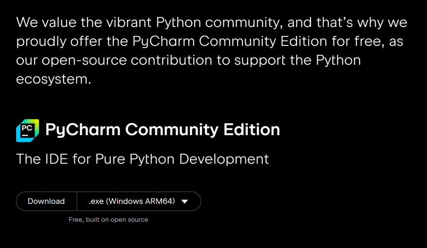
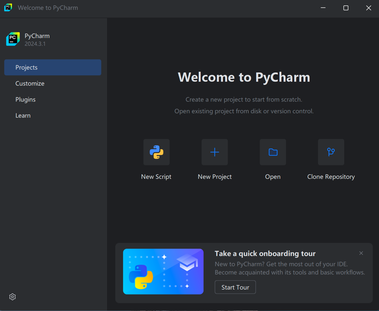

## 开始前的几个问题

### 什么是程序

### 什么是编程

### python能做什么

理论上能完成所有程序，擅长：
* AI
* Web后台开发
* 爬虫
* 科学计算
* 图形界面开发

## 开发环境准备

### 安装python

[下载安装包](https://www.python.org/downloads/release/python-3131/)





### 验证安装结果

打开命令行，输入

```shell
python --version
```

这时理论上我们就可以开始开发python程序了。

### 第一个Python程序

```python
print('Hello World')
```



### 安装IDE pycharm

[下载Community版本安装包](https://www.jetbrains.com/pycharm/download)



### 打开IDE



### 更复杂的Python程序

turtle


