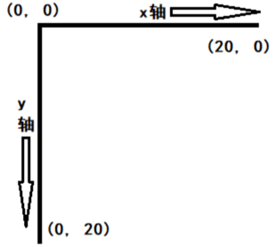
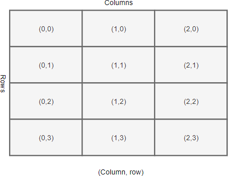
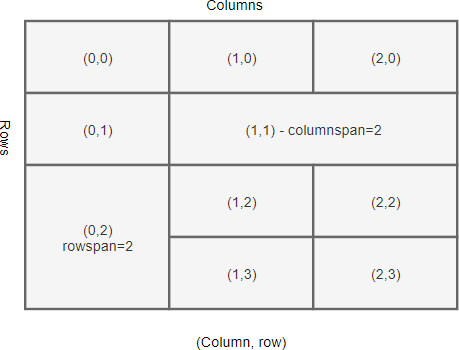

## tkinter

```python
import tkinter
import tkinter as tk
from tkinter import *
```

### 创建主窗口

```python
from tkinter import *

root = Tk() # 创建一个窗口
mainloop()  # 循环显示这个窗口
```

### 窗口坐标系



### 设置窗口属性

| 方法                                 | 描述                        |
|------------------------------------|---------------------------|
| title(string=None)                 | 设置窗口的标题，同时返回窗口标题          |
| geometry(newGeometry=None)         | 设置窗口的尺寸大小，同时返回当前窗口尺寸      |
| iconbitmap(bitmap=None)            | 设置窗口的图标，需指定图标文件(*.ico)的位置 |
| resizable(width=None, height=None) | 设定是否能够改变窗口的宽和高尺寸          |
| destroy()                          | 销毁窗口，也就是把窗口关掉             |

### 常用组件

#### Label

```python
from tkinter import *

root = Tk()
lab = Label(root, text="Hello, Tkinter!")
lab.pack()
```

#### Button

```python
from tkinter import *
 
root = Tk()
 
def callback():
    print("你点了一下按钮")
 
button = Button(root, text="按钮", command=callback)
button.pack()
 
mainloop()
```

### 布局管理

#### pack 适用于简单布局

* side:  
  组件靠哪个方向排放，  
  可以是："top", "bottom", "left", "right"，分别是上下左右，默认是"top"。
* anchor:  
  当排放组件的可用空间要多于所需空间时，组件靠哪个方向排放，  
  可选项是八个方位和中心（n, s, w, e, nw, ne, sw, se, center）。默认是"nw"。
* expand:  
  组件适应窗口。
  如设置为True，当窗口中有别的可用空间时，将会自动把组件居中摆放，并且拖拽后仍然适应窗口大小。默认为False。
* fill:  
  组件的填充，可选项有"x", "y", "both", "none"，默认为"none"。
* padx & pady:  
  分别表示组件与外部容器在x轴和y轴的间隔。  
  可以只提供一个数字，表示左右间隔或上下间隔，也可以提供一个两个项的元组表示左右间隔或上下间隔。不一定要一起设置。

#### grid 依照表格的行列方式布局

* column row



* columnspan rowspan



